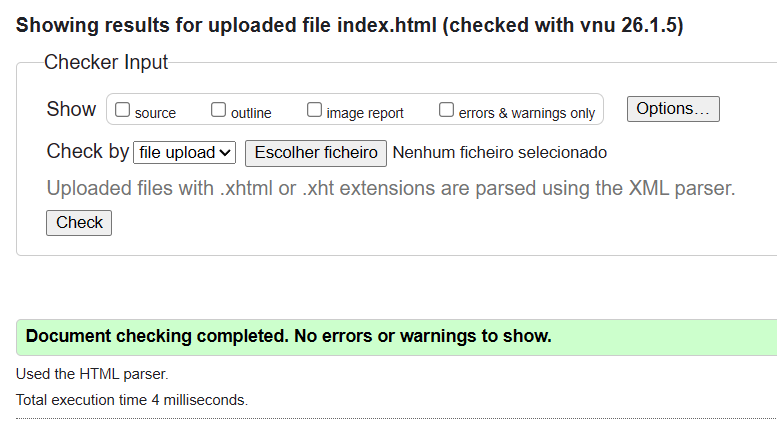
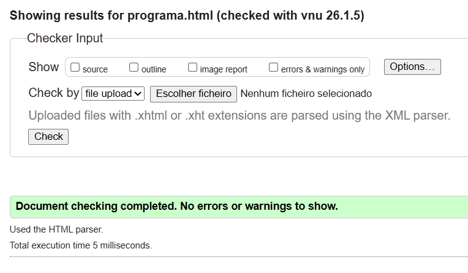
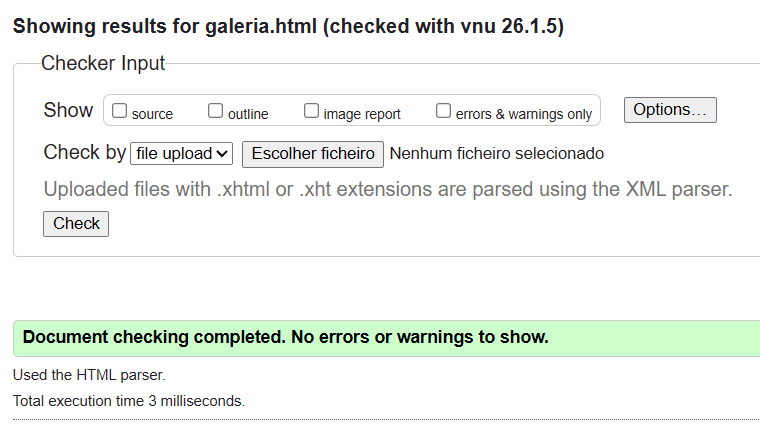
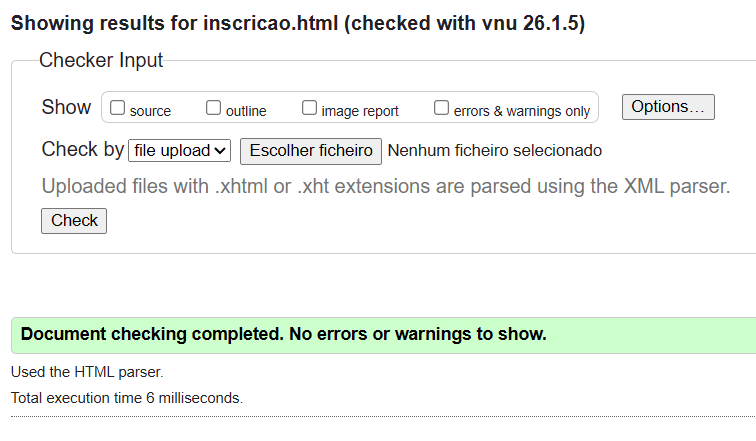
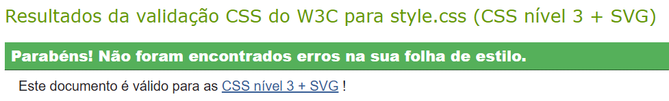

# tcm25twg05
# Frame Festival - Relatório do Projeto

## 1. Apresentação do Projeto
O **Frame Festival** é uma plataforma dedicada à celebração da criatividade emergente no campo do cinema e multimédia na Universidade da Maia. Este projeto web foi desenvolvido como parte da avaliação prática da unidade curricular de **Tecnologias Web**, focando-se na criação de uma experiência imersiva para a divulgação de curtas-metragens.

O site disponibiliza informações sobre horários, sinopses dinâmicas carregadas via XML e um sistema de inscrição direta, garantindo que os entusiastas da "7.ª Arte" tenham acesso a toda a informação necessária de forma moderna e intuitiva.

## 2. User Interface
A interface foi desenhada seguindo princípios de design moderno, utilizando a fonte **Montserrat** e uma paleta de cores académica (vermelho e bege) para transmitir profissionalismo e elegância.

* **Sitemap**: A navegação está estruturada entre Home, Programa, Galeria e Inscrição, permitindo um fluxo contínuo de informação.
* **Wireframes**: O layout utiliza um sistema de duas colunas (Main e Sidebar) para organizar conteúdos principais e secundários, adaptando-se a ecrãs de desktop e dispositivos móveis através de Media Queries.

## 3. Produto

### Descrição e Instalação
O produto final é um sítio Web estático e dinâmico, organizado em pastas estruturadas (`css`, `js`, `xml`, `images`) para facilitar a manutenção e escalabilidade.
* **Instalação**: Clonar o repositório e abrir o ficheiro `index.html` em qualquer navegador moderno.
* **Disponibilização**: O site está alojado em Netlify (tcm25twg05.netlify.app).

### Ajuda à Navegação
O menu de navegação no topo utiliza a classe `.active` para destacar a página atual, oferecendo feedback imediato ao utilizador. Na página de Programa, as linhas da tabela de horários são interativas (clicáveis), funcionando como âncoras diretas para os detalhes dos filmes na Galeria.

### Validação de Formulários
O formulário de inscrição em `inscricao.html` utiliza validação nativa do HTML5 (atributos `required` e `type="email"`) para garantir a integridade dos dados inseridos. O JavaScript intercepta o envio para simular o sucesso da inscrição através de um alerta personalizado e limpeza automática dos campos.

### Validação HTML e CSS
Todos os ficheiros foram testados e validados através do serviço da **W3C**, garantindo que o código segue os padrões internacionais da web e não contém erros de sintaxe ou marcação semântica incorreta.

**Comprovativos de Validação:**

* **HTML Index:** 
* **HTML Programa:** 
* **HTML Galeria:** 
* **HTML Inscrição:** 
* **CSS Style:** 

### Detalhes de Implementação
| Requisito Técnico | Implementação |
| :--- | :--- |
| **Integração XML** | Consumo de dados via AJAX (XMLHttpRequest) do ficheiro `filmes.xml`. |
| **Marcação Semântica** | Uso rigoroso de tags HTML5 como `<main>`, `<section>` e `<article>`. |
| **CSS3 Avançado** | Uso de Flexbox para alinhamento dinâmico e Grid para o layout global. |
| **Manipulação do DOM** | JavaScript utilizado para abrir/fechar detalhes dos cartazes e trocar classes CSS. |
| **Responsividade** | Layout totalmente adaptável para telemóvel e desktop via Media Queries. |
